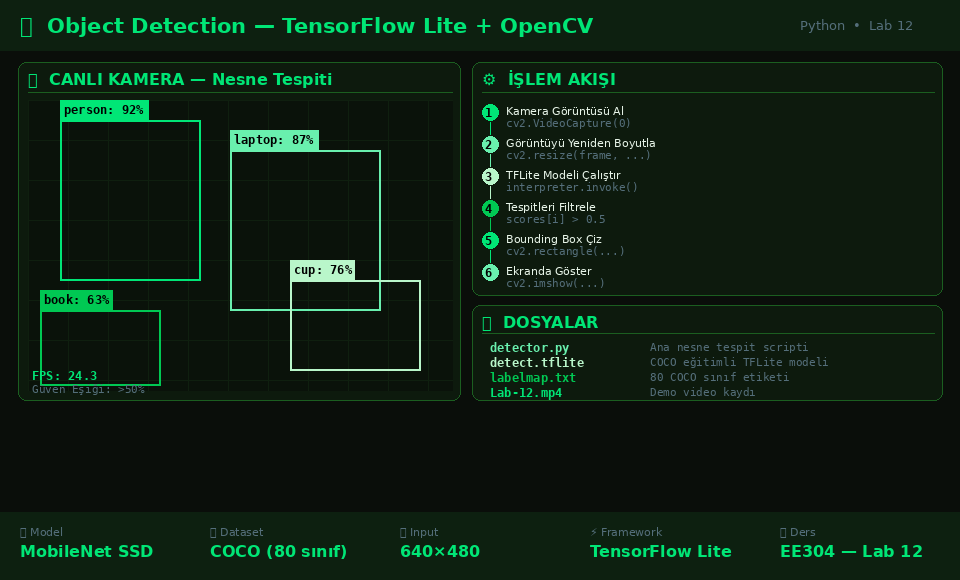

# 🔍 Object Detection — TensorFlow Lite + OpenCV



TensorFlow Lite ve OpenCV kullanarak gerçek zamanlı nesne tespiti yapan Python uygulaması. COCO veri setiyle eğitilmiş MobileNet SSD modeli ile kamera görüntüsünde 80 farklı nesne sınıfı tespit edilebilir.

## ⚙️ İşlem Akışı

1. Kameradan görüntü yakala (`cv2.VideoCapture`)
2. Görüntüyü model boyutuna getir (`cv2.resize`)
3. TFLite modelini çalıştır (`interpreter.invoke()`)
4. %50 üzeri güven skorlarını filtrele
5. Bounding box ve etiket çiz (`cv2.rectangle`)
6. Ekranda göster (`cv2.imshow`)

## 📁 Dosyalar

| Dosya | Açıklama |
|-------|----------|
| `object_detection_project/detector.py` | Ana nesne tespit scripti |
| `object_detection_project/detect.tflite` | COCO eğitimli TFLite modeli |
| `object_detection_project/labelmap.txt` | 80 COCO sınıf etiketi |
| `Lab-12.mp4` | Demo video kaydı |
| `Lab12_Object_Detection_Report.docx` | Lab raporu |

## 🛠️ Kurulum

```bash
pip install opencv-python tensorflow numpy
python detector.py
```

## 🧠 Model Detayları

| Özellik | Detay |
|---------|-------|
| Model | MobileNet SSD |
| Dataset | COCO (80 sınıf) |
| Format | TensorFlow Lite |
| Input | 640×480 |
| Güven Eşiği | %50 |

## 📚 Ders Bilgisi
**EE304 — Embedded Systems  |  Lab 12**

## 👩‍💻 Geliştirici
**Beyza Erdem** — 2211051049
